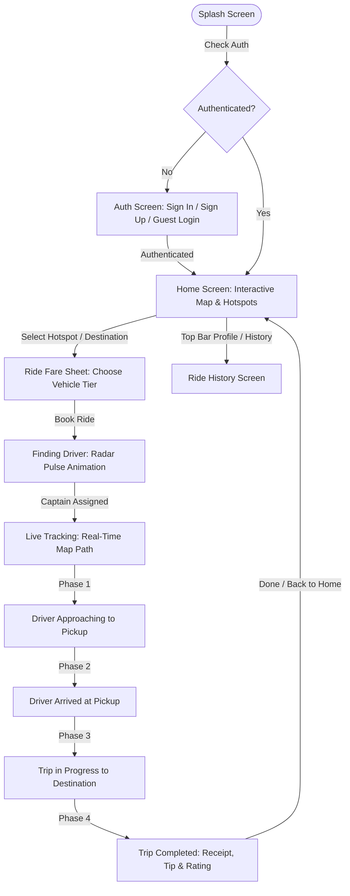

# 🚖 Vybe Cabs — Ride-Hailing Flutter Mobile Application

[](https://flutter.dev)
[](https://dart.dev)
[](https://bloclibrary.dev)
[](https://firebase.google.com)
[](https://developers.google.com/maps)
[](https://blog.cleancoder.com/uncle-bob/2012/08/13/the-clean-architecture.html)

**Vybe Cabs** is a production-grade, full-lifecycle ride-hailing mobile application built with **Flutter**, **BLoC/Cubit State Management**, **Clean Architecture**, real **Firebase Authentication**, and the **Google Maps SDK** featuring real-time animated vehicle tracking.

---

## 📋 Architectural Overview & Technical Choices

### 1. Architecture Choices
The codebase strictly adheres to Uncle Bob’s **Clean Architecture** combined with a feature-driven presentation layer and **BLoC (Business Logic Component)** state management:

- **Domain Layer (`lib/domain/`)**: Completely independent of Flutter and third-party frameworks. Contains pure Dart domain entities (`Ride`, `Driver`, `LocationEntity`, `VehicleType`, `UserEntity`), abstract repository contracts (`IAuthRepository`, `IRideRepository`), and discrete use cases (`SignInUseCase`, `FindDriverUseCase`, `GetTripRouteUseCase`, etc.).
- **Data Layer (`lib/data/`)**: Responsible for data retrieval and persistence. Implements repository interfaces (`AuthRepositoryImpl`, `RideRepositoryImpl`) and coordinates between remote sources (`AuthRemoteDataSource` with Firebase) and local sources (`LocalDummyDataSource`, `RideLocalDataSource`).
- **Presentation Layer (`lib/presentation/`)**:
  - **100% Stateless Screens**: Every screen in `lib/presentation/screens/` is a pure `StatelessWidget`.
  - **Zero `setState` Calls**: All UI mutations and asynchronous states are driven reactively via BLoCs (`AuthBloc`, `LocationBloc`, `BookingBloc`, `TrackingBloc`, `HistoryBloc`) and Cubits (`AuthFormCubit`, `ThemeCubit`).
  - **Modular Widget Decomposition**: Every single file across the entire repository is strictly **$\le 250$ lines of code** for maximum maintainability and separation of concerns.
- **Dependency Injection (`lib/core/services/service_locator.dart`)**: Uses `GetIt` for decoupled dependency injection, registering singletons for repositories/services and factories for BLoCs.

---

### 2. Auth Method Used
The application implements **Real Firebase Authentication** with comprehensive session management:

- **Email & Password Authentication**: Real `FirebaseAuth.instance.signInWithEmailAndPassword` and `createUserWithEmailAndPassword` with Full Name captured during Sign Up (saved directly as Firebase `displayName`).
- **Reactive Session Stream**: Listens to `FirebaseAuth.instance.authStateChanges()` to automatically handle login/logout state transitions across app launches.
- **Guest / Demo Login**: A one-tap "Guest Login" option on the login screen that automatically populates verified test credentials (`rider@vybecabs.com` / `Password123!`) and signs in for quick demonstration and evaluation.
- **Field-Specific Error Mapping**: Firebase error codes (`email-already-in-use`, `wrong-password`, `user-not-found`, `invalid-email`) are mapped directly beneath the corresponding input fields via `AuthFormCubit`.

---

### 3. Dummy Data Structure
Simulated ride data is structured cleanly into strongly-typed domain entities and data models:

- **Locations & Hotspots (`LocationModel` / `LocationEntity`)**: Structured Bangalore locations with coordinates, titles, subtitles, and categorized tags (`Airport`, `Tech Park`, `Mall`, `Station`, `Popular`) for search and category filtering.
- **Vehicle Tiers (`VehicleTypeModel` / `VehicleType`)**: 4 distinct ride tiers (`Vybe Go`, `Vybe Prime Sedan`, `Vybe Electric EV`, `Vybe Premier XL`) with base fares, per-km rates, per-minute rates, passenger capacities, and estimated ETAs.
- **Drivers (`DriverModel` / `Driver`)**: Realistic driver profiles with driver names, phone numbers, ratings (e.g. 4.9⭐), vehicle models (e.g. "Tata Nexon EV"), registration plates ("KA 01 EK 4829"), and dummy avatar images.
- **Rides & History (`RideModel` / `Ride`)**: Full ride entity encapsulating `pickup`, `destination`, `driver`, `fare`, `distanceKm`, `status` (`driverAssigned` ➔ `driverArrived` ➔ `inProgress` ➔ `completed`), `createdAt` timestamps, and user ratings. Completed rides are automatically prepended to the user's ride history in real time.
- **Simulated Polyline Waypoints (`PathGenerator`)**: Generates realistic intermediate GPS coordinates between pickup and destination using spherical linear interpolation (`GeoUtils.interpolate`) with realistic city road offsets for animated live map tracking and bearing (heading) rotation.

---

## 📱 App Highlights & User Flow



---

## 🏛️ Folder Structure

```
lib/
├── core/
│   ├── constants/            # AppColors, AppStrings, AppTextStyles, AppAssets, MapStyles
│   ├── errors/               # Failure & Exception definitions
│   ├── routes/               # GoRouter paths & configuration (AppRouter)
│   ├── services/             # GetIt dependency injection & LocationService
│   ├── theme/                # Light & Dark ThemeData configurations
│   └── utils/                # GeoUtils (spherical math & bearing), PathGenerator, UiHelpers
├── data/
│   ├── datasources/          # AuthRemoteDataSource (Firebase), LocalDummyDataSource, DummySeedHistory
│   ├── models/               # UserModel, DriverModel, RideModel, VehicleTypeModel, LocationModel
│   └── repositories/         # AuthRepositoryImpl, RideRepositoryImpl
├── domain/
│   ├── entities/             # UserEntity, Driver, Ride, VehicleType, LocationEntity
│   ├── repositories/         # IAuthRepository, IRideRepository
│   └── usecases/             # Modular use cases for Auth & Ride lifecycle
├── presentation/
│   ├── blocs/                # AuthBloc, AuthFormCubit, BookingBloc, LocationBloc, TrackingBloc, HistoryBloc, ThemeCubit
│   ├── screens/              # 100% Stateless screens (Splash, Auth, Home, FindingDriver, LiveTracking, TripCompleted, History)
│   └── widgets/              # Map, Cards, BottomSheets, and Common UI components
├── firebase_options.dart     # Firebase configuration
└── main.dart                 # Application entrypoint & MultiBlocProvider setup
```

---

## 🧪 Automated Testing & Code Quality

### Static Analysis
```bash
flutter analyze
```
*Result:* `No issues found! (0 warnings, 0 lints)`

### Automated Unit & BLoC Tests
```bash
flutter test
```
*Result:* `All 22 tests passed!`

**Covered Test Suites:**
- **Auth**: `AuthBloc` (login, signup, session changes) & `AuthFormCubit` (validation errors, mode toggle, password visibility).
- **Location & Booking**: `LocationBloc` (GPS current location, hotspot filtering) & `BookingBloc` (fare calculations, driver matching).
- **Live Tracking**: `TrackingBloc` (approach ticks, arrival, trip navigation, trip completion, star ratings, tips).
- **Ride History**: `HistoryBloc` (loading past rides, preserving new completed rides in descending order).
- **Theme**: `ThemeCubit` (Dark/Light mode toggling).
- **Domain & Math**: `GeoUtils` (bearing, distance, spherical interpolation) & Model JSON serialization roundtrips.

---

## 🚀 Getting Started

### Prerequisites
- **Flutter SDK**: `>= 3.35.0`
- **Dart SDK**: `>= 3.9.0`
- **Android Studio / Xcode** with emulator or connected physical device

### Installation & Run
```bash
# 1. Clone the repository
git clone <repo-url>
cd vybecabs_assignment

# 2. Get dependencies
flutter pub get

# 3. Run the app
flutter run
```

---

## 📄 License
This project was created for the Vybe Cabs developer assignment.
