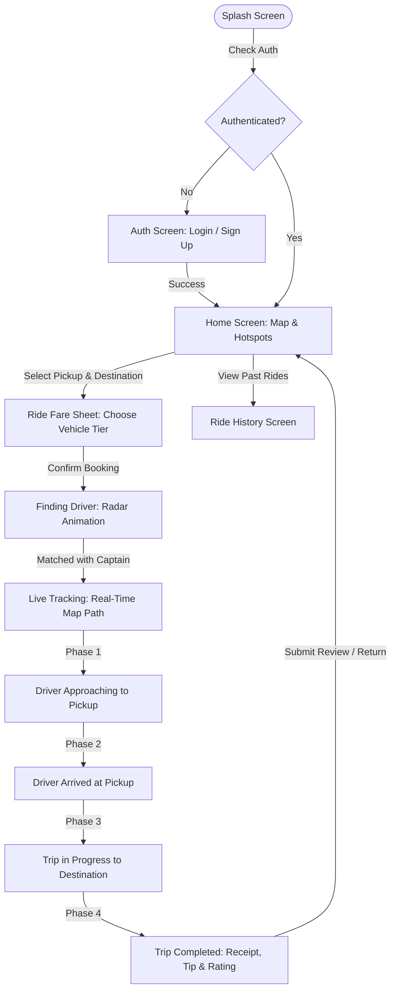

# 🚖 Vybe Cabs — Ride-Hailing Flutter Mobile Application

[](https://flutter.dev)
[](https://dart.dev)
[](https://bloclibrary.dev)
[](https://firebase.google.com)
[](https://developers.google.com/maps)
[](https://blog.cleancoder.com/uncle-bob/2012/08/13/the-clean-architecture.html)

**Vybe Cabs** is a production-grade, full-lifecycle ride-hailing mobile application built with **Flutter**, **BLoC State Management**, **Clean Architecture**, real **Firebase Authentication**, and the **Google Maps SDK** featuring real-time animated vehicle tracking.

---

## 📱 App Highlights & Screenshots

* **Authentic Brand Design**: Custom Vybe Flame Orange (`#FF4E27`), sleek Obsidian Dark theme (`#0F1015`), and high-contrast Light mode.
* **Full Booking Lifecycle**: Seamless multi-screen flow from authentication to ride completion receipt and ride history.
* **Animated Driver Tracking**: High-frequency waypoint advancement, bearing angle rotation (heading), and camera tracking on Google Maps.

---

## 🎯 Assessment Criteria & Technical Implementation

| Criteria | Implementation Highlights | Key Source Files |
| :--- | :--- | :--- |
| **1. Real Firebase Auth** | • Real `FirebaseAuth.instance` calls<br>• Email/Password Sign Up with display name<br>• Login, Sign Out & Password Reset<br>• Reactive `authStateChanges` session stream<br>• Comprehensive Firebase error mapping | • [`auth_remote_datasource.dart`](file:///Users/rohith_n/Documents/tasks/vybecabs_assignment/lib/data/datasources/auth_remote_datasource.dart)<br>• [`auth_repository_impl.dart`](file:///Users/rohith_n/Documents/tasks/vybecabs_assignment/lib/data/repositories/auth_repository_impl.dart)<br>• [`auth_bloc.dart`](file:///Users/rohith_n/Documents/tasks/vybecabs_assignment/lib/presentation/blocs/auth/auth_bloc.dart)<br>• [`firebase_options.dart`](file:///Users/rohith_n/Documents/tasks/vybecabs_assignment/lib/firebase_options.dart) |
| **2. Google Maps SDK** | • Interactive custom styled map (Dark/Light)<br>• Custom vehicle, pickup, & dropoff markers<br>• Route polylines with remaining path clipping<br>• Spherical bearing calculation (`GeoUtils.calculateBearing`)<br>• Dynamic camera auto-following moving car | • [`custom_map_view.dart`](file:///Users/rohith_n/Documents/tasks/vybecabs_assignment/lib/presentation/widgets/map/custom_map_view.dart)<br>• [`tracking_bloc.dart`](file:///Users/rohith_n/Documents/tasks/vybecabs_assignment/lib/presentation/blocs/tracking/tracking_bloc.dart)<br>• [`geo_utils.dart`](file:///Users/rohith_n/Documents/tasks/vybecabs_assignment/lib/core/utils/geo_utils.dart)<br>• [`map_styles.dart`](file:///Users/rohith_n/Documents/tasks/vybecabs_assignment/lib/core/constants/map_styles.dart) |
| **3. State Management** | • Multi-BLoC architecture (`Auth`, `Location`, `Booking`, `Tracking`, `History`, `Theme`)<br>• Strict unidirectional data flow with immutable events & states<br>• Declarative GoRouter route flow & lifecycle guards | • [`service_locator.dart`](file:///Users/rohith_n/Documents/tasks/vybecabs_assignment/lib/core/services/service_locator.dart)<br>• [`app_router.dart`](file:///Users/rohith_n/Documents/tasks/vybecabs_assignment/lib/core/routes/app_router.dart)<br>• [`presentation/blocs/`](file:///Users/rohith_n/Documents/tasks/vybecabs_assignment/lib/presentation/blocs/) |
| **4. Clean UI/UX & Motion** | • Dynamic radar pulse animation on driver matching<br>• Polished modal bottom sheets for ride selection<br>• Driver profile card with call/message actions & OTP<br>• Ride completion receipt with tip chips & interactive star rating<br>• Instantaneous Dark/Light mode switcher | • [`finding_driver_screen.dart`](file:///Users/rohith_n/Documents/tasks/vybecabs_assignment/lib/presentation/screens/booking/finding_driver_screen.dart)<br>• [`pulse_radar.dart`](file:///Users/rohith_n/Documents/tasks/vybecabs_assignment/lib/presentation/widgets/common/pulse_radar.dart)<br>• [`live_tracking_screen.dart`](file:///Users/rohith_n/Documents/tasks/vybecabs_assignment/lib/presentation/screens/tracking/live_tracking_screen.dart)<br>• [`trip_completed_screen.dart`](file:///Users/rohith_n/Documents/tasks/vybecabs_assignment/lib/presentation/screens/tracking/trip_completed_screen.dart) |
| **5. Clean Architecture** | • Decoupled Domain (Entities, Use Cases, Repositories)<br>• Pluggable DataSources via GetIt dependency injection<br>• Seamless swap from local dummy datasets to live REST/GraphQL APIs | • [`domain/`](file:///Users/rohith_n/Documents/tasks/vybecabs_assignment/lib/domain/)<br>• [`data/`](file:///Users/rohith_n/Documents/tasks/vybecabs_assignment/lib/data/)<br>• [`service_locator.dart`](file:///Users/rohith_n/Documents/tasks/vybecabs_assignment/lib/core/services/service_locator.dart) |

---

## 🏛️ Architecture & Folder Structure

The project strictly follows Uncle Bob's **Clean Architecture** with a feature-driven presentation layer:

```
lib/
├── core/
│   ├── constants/            # AppColors, AppStrings, AppTextStyles, AppAssets, MapStyles
│   ├── errors/               # Failure & Exception classes
│   ├── routes/               # GoRouter paths & configuration (AppRouter)
│   ├── services/             # GetIt dependency injection (service_locator.dart) & LocationService
│   ├── theme/                # Light & Dark ThemeData configurations
│   └── utils/                # GeoUtils (spherical math/bearing) & UiHelpers (formatters/custom icons)
├── data/
│   ├── datasources/          # AuthRemoteDataSource (Firebase), RideLocalDataSource, LocalDummyDataSource
│   ├── models/               # UserModel, DriverModel, RideModel, VehicleTypeModel, LocationModel
│   └── repositories/         # AuthRepositoryImpl, RideRepositoryImpl
├── domain/
│   ├── entities/             # UserEntity, Driver, Ride, VehicleType, LocationEntity
│   ├── repositories/         # IAuthRepository, IRideRepository
│   └── usecases/             # Auth & Ride modular use cases
├── presentation/
│   ├── blocs/                # Auth, Booking, Location, Tracking, History, Theme (BLoC / Cubit)
│   ├── screens/              # Splash, Auth, Home, FindingDriver, LiveTracking, TripCompleted, History
│   └── widgets/              # Map, Cards, BottomSheets, and Common Atoms/Molecules
├── firebase_options.dart     # Firebase configuration
└── main.dart                 # Application entrypoint & multi-bloc provider setup
```

---

## 🔄 User Journey & Navigation Flow



---

## 🚀 Getting Started

### Prerequisites
* **Flutter SDK**: `>= 3.35.0`
* **Dart SDK**: `>= 3.9.0`
* **Xcode** (for iOS simulator/device) / **Android Studio** (for Android emulator/device)

### Installation & Run

1. **Clone the repository**:
   ```bash
   git clone <repo-url>
   cd vybecabs_assignment
   ```

2. **Install dependencies**:
   ```bash
   flutter pub get
   ```

3. **Run on connected device / simulator**:
   ```bash
   flutter run
   ```

---

## 🧪 Automated Testing & Code Quality

The project includes unit, BLoC, and data serialization test suites.

### Run Static Analysis
```bash
flutter analyze
```
*Result:* `No issues found!`

### Run Automated Unit & BLoC Tests
```bash
flutter test
```
*Result:* `All 18 tests passed!`

**Covered Test Cases:**
- `GeoUtils`: Bearing calculations, distance determination, waypoint path subdivision and interpolation.
- `Data Models`: JSON serialization/deserialization for `UserModel`, `DriverModel`, `RideModel`, `LocationModel`, and `VehicleTypeModel`.
- `Ride Repository`: Local dummy datasets, hotspot retrieval, vehicle tier pricing formulas, and history persistence.
- `BLoC Units`:
  - `AuthBloc`: `AppStarted`, `SignInRequested`, `SignUpRequested`, `SignOutRequested`.
  - `LocationBloc`: Current GPS loading and hotspot suggestions.
  - `BookingBloc`: Vehicle tier configuration, dynamic fare estimation, driver matching.
  - `TrackingBloc`: Waypoint progress ticks, driver arrival, trip initiation, completion.
  - `HistoryBloc`: Loading completed rides and preserving newly completed rides.
  - `ThemeCubit`: Dark/Light theme switching and state persistence.

---

## 🎨 App Icon & Launcher Configuration

The application includes high-resolution master icons and launcher assets:
- **Master Icon**: `assets/icon/app_icon.png` (1024×1024)
- **Adaptive Icon (Android 8.0+)**: `android/app/src/main/res/mipmap-anydpi-v26/ic_launcher.xml` with `#0F1015` background.
- **Legacy Mipmap Densities**: `mipmap-mdpi`, `mipmap-hdpi`, `mipmap-xhdpi`, `mipmap-xxhdpi`, `mipmap-xxxhdpi`.
- **iOS AppIcon Catalog**: Complete set in `ios/Runner/Assets.xcassets/AppIcon.appiconset/`.

To regenerate launcher icons at any time:
```bash
dart run flutter_launcher_icons
```

---

## 📄 License

This project was created for the Vybe Cabs developer assignment.
